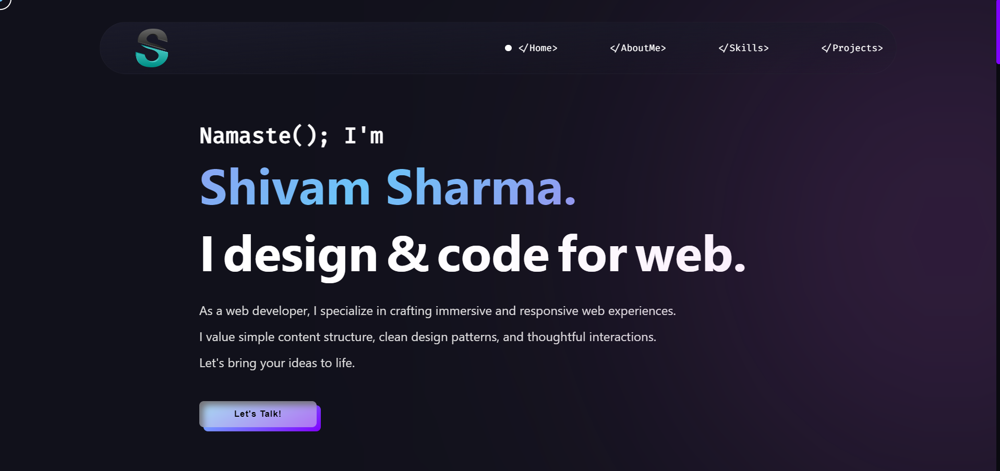

<p align="center"></p>

<h1 align="center" id="title">Portfolio Website</h1>

<h4> Welcome to my portfolio website! This website showcases my skills, projects, and provides an insight into who I am as a developer. It is built using HTML, CSS, and JavaScript, with the addition of the AOS (Animate On Scroll) library for animations.</h4>

## 🖥️ Tech Stack

<p align="left">
&nbsp;&nbsp;
    &nbsp;&nbsp;
        &nbsp;&nbsp;
            &nbsp;&nbsp;
</p>


<h3>Deployed On:</h3>
<p></p>


<h2>🚀 Demo</h2>

[https://portfolio-website-eta-pink.vercel.app](https://portfolio-website-eta-pink.vercel.app)

<h2>Project Snapshot:</h2>


<h2>⚡️ Features</h2>

- **Responsive Design:** The website is designed to adapt to various screen sizes, ensuring a seamless experience across devices.
- **About Me Section:** Learn about my background, interests, and experiences as a developer.
- **Skills Section:** Explore the different skills I possess, including programming languages, frameworks, and tools.
- **Projects Section:** View the projects I have worked on, along with brief descriptions and links to live demos or repositories.
- **Animations:** Utilizes AOS library for scroll-triggered animations and custom animations for enhanced visual effects.

<h2>🚩 Getting Started</h2>

### Clone the repository:
```bash
git clone <https://github.com/Azarex145/portfolio_website.git>
```
### Navigate to the project directory:
```bash
cd portfolio_website
```

### Launch the Live Server
